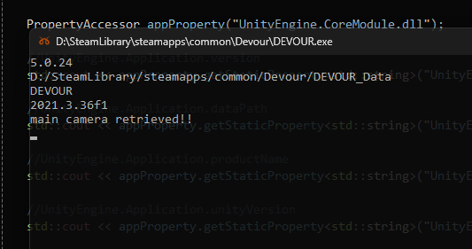
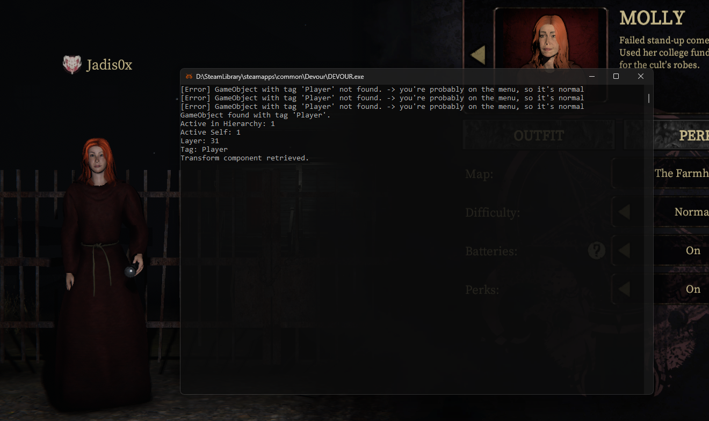

[](https://github.com/jadis0x/il2cpp-reverse-engineering-guide/stargazers)
[](https://github.com/jadis0x/il2cpp-reverse-engineering-guide/graphs/contributors)
[](https://opensource.org/licenses/MIT)

<h3 align="center">Il2cppInspector: C++ Scaffold Guide</h3>

<p>Hello! I have decided to share some useful examples regarding the usage of Il2cppInspector C++ scaffold. In this guide, I will provide examples of how to interact with defined Il2cpp API functions.</p>

### Installation
You can get the latest version of Il2CppInspector 2023.1 [here](https://github.com/jadis0x/il2cpp-reverse-engineering-guide/releases/tag/2023.1).

### Requirements
Having knowledge of C++ and C# is essential. You should also be familiar with the basics of the Unity game engine.

> [!NOTE]  
> I wrote my own helper class. You can access it under the lib folder. Throughout the guide, I will be using the helper functions I created.
  
## Video
[](https://www.youtube.com/watch?v=L7s2ttcNEh0)

## Contact
If you have any questions, feel free to reach out to me.</br>

Discord: Jadis0x </br>
Steam: Jadis0x

## Examples
> [!TIP]
> You can find more detailed examples by taking a look at [HERE](https://github.com/ALittlePatate/DevourClient) using the Il2cppInspector analysis tool I used to create the cheat.

## Contents

<nav>
  <ul>
    <li><a href="#get_assemblies">Get the assemblies</a></li>
    <li><a href="#type_usage">Converting an Il2CppObject* to Type* and Understanding Its Usage</a></li>
    <li><a href="#get_class_names_types">Getting class names and types from a specific assembly</a></li>
    <li><a href="#get_info_method">Getting information about any method</a></li>
    <li><a href="#call_function">Executing a Method Using "il2cpp_runtime_invoke"</a></li>
    <li><a href="#list_all_functions">Getting a List of All Functions in the Target Class</a></li>
    <li><a href="#get_field_info">Getting Information about Class Fields (FieldInfo)</a></li>
    <li><a href="#modify_field">Changing the Value of a Class Field</a></li>
    <li><a href="#write_FindObjectOfType_function">Creating a Helper Function to Find Objects of a Specific Type ("FindObjectOfType")</a></li>
    <li><a href="#readingProperty">Reading and Managing Static and Instance Properties"</a></li>
  </ul>
</nav>

<h2 id="get_assemblies">Get the assemblies</h2>

<span>This code snippet demonstrates how to retrieve a list of all assemblies within the active domain using il2cpp API functions.</span>

```cpp
// Get the active domain
const Il2CppDomain* domain = il2cpp_domain_get();

// Define variables to hold the assembly list
const Il2CppAssembly** assemblies;
size_t size;

// Use the il2cpp_domain_get_assemblies function to retrieve all assemblies
assemblies = il2cpp_domain_get_assemblies(domain, &size);

// Iterate through each assembly in the list
for (size_t i = 0; i < size; ++i) {
    const Il2CppAssembly* assembly = assemblies[i];

    if (assembly) {
        // Get the assembly name using il2cpp_image_get_name function
        const char* assemblyName = il2cpp_image_get_name(assembly->image);
        
        // Print the name of the assembly to the console
        std::cout << assemblyName << "\n";
    }
}
```

<h2>Summary of Get the assemblies</h2>

<ol>
    <li>
        <strong>Get the Active Domain:</strong>
        <ul>
            <li><strong>Function:</strong> <code>il2cpp_domain_get</code></li>
            <li><strong>Description:</strong> Retrieves the active domain (<code>Il2CppDomain</code>) where the program is currently running.</li>
        </ul>
    </li>
    <li>
        <strong>Retrieve Assemblies:</strong>
        <ul>
            <li><strong>Function:</strong> <code>il2cpp_domain_get_assemblies</code></li>
            <li><strong>Description:</strong> Retrieves a list of all assemblies (<code>Il2CppAssembly</code>) within the specified domain (<code>Il2CppDomain</code>). The function returns an array of <code>Il2CppAssembly</code> pointers (<code>assemblies</code>) and updates the <code>size</code> variable with the number of assemblies found.</li>
        </ul>
    </li>
    <li>
        <strong>Iterate Through Assemblies:</strong>
        <ul>
            <li>Using a <code>for</code> loop, iterate through each assembly in the <code>assemblies</code> array.</li>
        </ul>
    </li>
    <li>
        <strong>Get Assembly Name:</strong>
        <ul>
            <li><strong>Function:</strong> <code>il2cpp_image_get_name</code></li>
            <li><strong>Description:</strong> Retrieves the name of the assembly associated with the given image (<code>Il2CppImage</code>) within the assembly structure (<code>Il2CppAssembly</code>). It returns a <code>const char*</code> containing the assembly name.</li>
        </ul>
    </li>
    <li>
        <strong>Print Assembly Names:</strong>
        <ul>
            <li>Print each assembly name retrieved from <code>il2cpp_image_get_name</code> to the console (<code>std::cout</code>).</li>
        </ul>
    </li>
</ol>

<p>Output: </p>


<br>

<h2 id="type_usage">Converting an Il2CppObject* to Type* and Understanding Its Usage</h2>

To obtain the type information here, we will use the GetTypeFromClass function inside my Il2cppHelper class.

```cpp
Il2CppObject* Il2CppHelper::GetTypeFromClass(const Il2CppImage* _image, const char* _namespaze, const char* _name)
{
    // Retrieve the class information using the image, namespace, and class name
    Il2CppClass* _targetClass = il2cpp_class_from_name(_image, _namespaze, _name);

    // If the class is found
    if (_targetClass) {
        // Get the type information from the class
        const Il2CppType* _targetType = il2cpp_class_get_type(_targetClass);

        // If the type information is found
        if (_targetType) {
            // Get the Il2CppObject from the type information
            Il2CppObject* targetObject = il2cpp_type_get_object(_targetType);

            // If the object is successfully retrieved, return it
            if (targetObject) {
                return targetObject;
            }
        }
    }

    // If any step fails, return nullptr
    return nullptr;
}
```

<span>First, load the CoreModule from Unity, which contains many fundamental classes such as GameObject.</span>

```cpp
const Il2CppImage* _CoreModule = _helper->GetImage("UnityEngine.CoreModule.dll");
```

<span>If the module is successfully loaded, use the GetTypeFromClass function to get the type information for the GameObject class.</span>

```cpp
if (_CoreModule) {
    // Get the type information for the GameObject class in the UnityEngine namespace
    Il2CppObject* _object = _helper->GetTypeFromClass(_CoreModule, "UnityEngine", "GameObject");

    // If the type information is successfully retrieved
    if (_object) {
        // Cast the Il2CppObject to Type
        Type* gameobjectType = reinterpret_cast<Type*>(_object);

        // If the type casting is successful
        if (gameobjectType) {
            // Find all objects of the GameObject type
            Object_1__Array* getAllGameObjects = Object_1_FindObjectsOfType(gameobjectType, nullptr);

            // Print the count of GameObject instances
            std::cout << "Gameobject count: " << getAllGameObjects->max_length << "\n";

            // If any GameObject instances are found
            if (getAllGameObjects) {
                // Iterate through each GameObject instance
                for (int i = 0; i < getAllGameObjects->max_length; i++) {
                    Object_1* currentGameObject = getAllGameObjects->vector[i];

                    // If the GameObject is active in the hierarchy
                    if (GameObject_get_activeInHierarchy(reinterpret_cast<GameObject*>(currentGameObject), nullptr)) {
                        // Print the name of the active GameObject
                        std::cout << "GameObject Name: " << il2cppi_to_string(Object_1_GetName(currentGameObject, nullptr)) << "\n";
                    }
                }
            }
        }
    }
}
```

<span>In this example, we are passing the type of the object to be found (GameObject) as a parameter to the Object_1_FindObjectsOfType function. This actually allows us to achieve the following:</span>

```cpp
GameObject[] allGameObjects = FindObjectsOfType<GameObject>();
```

> This function is quite slow. Using this function every frame is not recommended.

<h2>Summary of the Steps and il2cpp API Functions Used</h2>

<ol>
  <li>Loading the Image:
    <ul>
      <li>Function: <code>GetImage</code></li>
      <li>Description: Loads the <code>CoreModule</code> image from Unity, which contains fundamental classes like <code>GameObject</code>.</li>
    </ul>
  </li>
  <li>Retrieving Class Information:
    <ul>
      <li>Function: <code>il2cpp_class_from_name</code></li>
      <li>Description: Retrieves class information using the image, namespace, and class name.</li>
    </ul>
  </li>
  <li>Getting Type Information from Class:
    <ul>
      <li>Function: <code>il2cpp_class_get_type</code></li>
      <li>Description: Obtains the type information from the class.</li>
    </ul>
  </li>
  <li>Getting Il2CppObject from Type:
    <ul>
      <li>Function: <code>il2cpp_type_get_object</code></li>
      <li>Description: Converts type information into an <code>Il2CppObject</code>.</li>
    </ul>
  </li>
  <li>Casting Il2CppObject to Type:
    <ul>
      <li>Operation: <code>reinterpret_cast&lt;Type*&gt;</code></li>
      <li>Description: Casts the retrieved <code>Il2CppObject</code> to <code>Type</code>.</li>
    </ul>
  </li>
  <li>Finding Objects of a Specific Type:
    <ul>
      <li>Function: <code>Object_1_FindObjectsOfType</code></li>
      <li>Description: Finds all objects of the specified type (<code>GameObject</code> in this case).</li>
    </ul>
  </li>
  <li>Checking if GameObject is Active:
    <ul>
      <li>Function: <code>GameObject_get_activeInHierarchy</code></li>
      <li>Description: Checks if the <code>GameObject</code> is active in the hierarchy.</li>
    </ul>
  </li>
  <li>Getting GameObject Name:
    <ul>
      <li>Function: <code>Object_1_GetName</code></li>
      <li>Description: Retrieves the name of the <code>GameObject</code>.</li>
    </ul>
  </li>
</ol>

<p>Output: </p>


<br>

<h2 id="get_class_names_types">Getting class names and types from a specific assembly</h2>

<p>This code snippet demonstrates how to retrieve and print the names and namespaces of classes within a specified assembly using il2cpp API functions.</p>

```cpp
void Il2CppHelper::GetClassesAndNamesFromAssembly(const Il2CppImage* _image)
{
	if (_image) {
		size_t classCount = il2cpp_image_get_class_count(_image);

		std::cout << "{\n";

		for (size_t i = 0; i < classCount; ++i) {
			const Il2CppClass* _klass = il2cpp_image_get_class(_image, i);

			if (_klass) {
				char* _name = const_cast<char*>(il2cpp_class_get_name(const_cast<Il2CppClass*>(_klass)));
				char* _namespace = const_cast<char*>(il2cpp_class_get_namespace(const_cast<Il2CppClass*>(_klass)));

				std::cout << " [\n";
				std::cout << "\tName: " << _name << "\n";
				std::cout << "\tNamespace: " << _namespace << "\n";

				std::cout << " ],\n";
			}
		}

		std::cout << "\n}\n";
	}
}
```


```cpp
const Il2CppImage* _BoltDll = _helper->GetImage("bolt.dll");

if (_BoltDll) {
    _helper->GetClassesAndNamesFromAssembly(_BoltDll);
}
```

or

```cpp
const Il2CppImage* _assemblyCSHARP = _helper->GetImage("Assembly-CSharp.dll");

if (_assemblyCSHARP) {
   _helper->GetClassesAndNamesFromAssembly(_assemblyCSHARP);
}
```

<p>Outputs: </p>


<br>

<h2 id="get_info_method">Getting information about any method </h2>

* It allows you to print the name, return type, and parameter information of the target method.

```cpp
void Il2CppHelper::GetMethodInfo(const Il2CppImage* _image, const char* _funcName, int argLength, const char* _class_name, const char* _class_namespace)
{
	Il2CppClass* _class = il2cpp_class_from_name(_image, _class_namespace, _class_name);

	if (_class == nullptr) return;

	const MethodInfo* methodInfo = il2cpp_class_get_method_from_name(_class, _funcName, argLength);

	if (methodInfo == nullptr) return;

	Il2CppReflectionMethod* reflectionMethod = il2cpp_method_get_object(methodInfo, _class);

	// Check if the reflectionMethod is not null
	if (reflectionMethod == nullptr) return;

	std::cout << "{\n";

	// Get the method's name from the reflectionMethod object
	const char* methodName = il2cpp_method_get_name(methodInfo);
	std::cout << "\tMethod Name: " << methodName << std::endl;

	const Il2CppType* returnType = il2cpp_method_get_return_type(methodInfo);
	std::cout << "\tReturn Type: " << il2cpp_type_get_name(returnType) << std::endl;

	// Get the parameter count of the method using il2cpp_method_get_param_count
	int parameterCount = il2cpp_method_get_param_count(methodInfo);
	std::cout << "\tParameter Count: " << parameterCount << std::endl;

	std::cout << "\t[\n";
	// Get the parameter types of the method
	for (int i = 0; i < parameterCount; i++) {
		// Get the parameter type at index i using il2cpp_method_get_param
		const Il2CppType* parameterType = il2cpp_method_get_param(methodInfo, i);

		// Get the type name of the parameter type using il2cpp_type_get_name
		const char* parameterTypeName = il2cpp_type_get_name(parameterType);

		// Print the parameter type name to the console
		std::cout << "\t\tParameter " << i << " Type: " << parameterTypeName << std::endl;
	}
	std::cout << "\t]\n";

	std::cout << "}\n";
}
```


```cpp
const Il2CppImage* _AssemblyCSharp = _helper->GetImage("Assembly-CSharp.dll");
			
_helper->GetMethodInfo(_AssemblyCSharp, "SetFOV", 1, "NolanBehaviour", "");
```

<p>Output: </p>


<br><br>

<h2 id="call_function">Calling a function with "il2cpp_runtime_invoke"</h2> 

```cpp
if (GetAsyncKeyState(VK_F1) & 0x8000) {
	const Il2CppImage* _AssemblyCSharp = _helper->GetImage("Assembly-CSharp.dll");
	_helper->GetMethodInfo(_AssemblyCSharp, "SetRank", 1, "NolanRankController", "");
}

if (GetAsyncKeyState(VK_F2) & 0x8000) {
	const Il2CppImage* _csharp = _helper->GetImage("Assembly-CSharp.dll");
	if (_csharp == nullptr) return;

	Il2CppObject* nolanObj = _helper->GetTypeFromClass(_csharp, "", "NolanRankController");

	Type* TNolan = reinterpret_cast<Type*>(nolanObj);
	
	auto isTypeValid = Object_1_FindObjectOfType(TNolan, nullptr);

	if(isTypeValid){
	
		NolanBehaviour* _nb_ = reinterpret_cast<NolanBehaviour*>(isTypeValid);

		if (_nb_) {
			Il2CppClass* _nbClass = il2cpp_class_from_name(_csharp, "", "NolanRankController");
			if (_nbClass == nullptr) return;

			const MethodInfo* methodInfo = il2cpp_class_get_method_from_name(_nbClass, "SetRank", 1);

			int newRankvalue = 666;

			void* params[] = { &newRankvalue };

			std::cout << "call function..\n";
			il2cpp_runtime_invoke(methodInfo, _nb_, params, nullptr);
		}
	}
}
```

<p>Output: </p>


<br><br>

<h2 id="list_all_functions">Getting a List of All Functions in the Target Class</h2>

* This function, serves the purpose of obtaining and displaying a list of all methods within a given class (specified by the klass parameter). It iterates through each method in the class using a loop, retrieving information such as the method name and its return type. Subsequently, it prints out the method name along with its return type, providing a clear representation of the methods contained within the class

```cpp
void Il2CppHelper::PrintMethods(Il2CppClass* klass) {
	const MethodInfo* methodIter = nullptr;
	void* iter = nullptr;

	// Retrieve all methods of the class
	while ((methodIter = il2cpp_class_get_methods(klass, &iter)) != nullptr) {
		// Get the name of the method
		const char* methodName = il2cpp_method_get_name(methodIter);

		// Get the return type of the method
		const Il2CppType* methodReturnType = il2cpp_method_get_return_type(methodIter);
		char* returnTypeName = il2cpp_type_get_name(methodReturnType);

		// Print the method name and its return type
		std::cout << "Method Name: " << methodName;
		std::cout << " (" << returnTypeName << ")\n------------------------------------\n";

		// Perform necessary memory operations
		il2cpp_free(returnTypeName);
	}
}
```

## Example:

```cpp
const Il2CppImage* _image = _helper->GetImage("Assembly-CSharp.dll");

if (_image) {
	Il2CppClass* nolanRankControllerClass = il2cpp_class_from_name(_timage, "", "NolanRankController");

	if (nolanRankControllerClass != nullptr) {
		_helper->PrintMethods(nolanRankControllerClass);
	}
}
```

<p>Output: </p>


<br><br>

<h2 id="get_field_info">Getting Information about Class Fields (FieldInfo)</h2>

* It allows us to get information about the fields of a class

```cpp
void Il2CppHelper::GetFieldsInformation(Il2CppClass* klass)
{
	void* iter = nullptr;
	FieldInfo* field = nullptr;

	// Iterate through the fields of the class
	while ((field = il2cpp_class_get_fields(klass, &iter)) != nullptr)
	{
		// Get the name of the field
		const char* fieldName = il2cpp_field_get_name(field);

		// Get the type of the field
		const Il2CppType* fieldType = il2cpp_field_get_type(field);
		char* fieldTypeStr = il2cpp_type_get_name(fieldType);

		// Print the information about the field
		std::cout << "Field Name: " << fieldName << std::endl;
		std::cout << "Type: " << fieldTypeStr << std::endl;
		std::cout << "-----------\n";
	}
}
```


```cpp
const Il2CppImage* _assemblyCSHARP = _helper->GetImage("Assembly-CSharp.dll");
			
if (_assemblyCSHARP) {
	Il2CppClass* _nolanBehaviourClass = il2cpp_class_from_name(_assemblyCSHARP, "", "NolanBehaviour");

	_helper->GetFieldsInformation(_nolanBehaviourClass);
}
```

<p>Output: </p>


<br><br>

<h2 id="modify_field">Modifiying the Value of a Field</h2>

```cpp
if (GetAsyncKeyState(VK_F1) & 0x8000) {
	// Get the Il2CppImage for "Assembly-CSharp.dll"
	const Il2CppImage* _AssemblyCSharp = _helper->GetImage("Assembly-CSharp.dll");

	// Get the object for the "Menu" class within the "Horror" namespace
	Il2CppObject* _horrorMenuClassObject = _helper->GetTypeFromClass(_AssemblyCSharp, "Horror", "Menu");

	// Check if the object exists
	if (_horrorMenuClassObject) {

		// Find the object represented by _horrorMenuClassObject in the app
		auto menuType = app::Object_1_FindObjectOfType_1(reinterpret_cast<Type*>(_horrorMenuClassObject), true, nullptr);

		// Check if the object was found
		if (menuType) {

			// Get the Il2CppClass for the "Menu" class
			Il2CppClass* menuClass = il2cpp_class_from_name(_AssemblyCSharp, "Horror", "Menu");
			if (menuClass == nullptr) return;

			// Get the FieldInfo for the "steamName" field
			FieldInfo* steamNameField = il2cpp_class_get_field_from_name(menuClass, "steamName");

			// Check if the field exists
			if (steamNameField) {
				std::cout << "field is exists!!\n";

				// Define a new value for the field
				const char* newSteamNameValue = "il2cpp-field";

				// Create a new Il2CppString from the new value
				Il2CppString* newSteamNameString = il2cpp_string_new(newSteamNameValue);

				// Set the field's value to the new value
				il2cpp_field_set_value(_horrorMenuClassObject, steamNameField, newSteamNameString);
			}
			else {
				std::cout << "field is not exists!\n";
			}
		}
	}
}
```

<br><br>

<h2 id="write_FindObjectOfType_function">Creating a Helper Function to Find Objects of a Specific Type ("FindObjectOfType")</h2>

**FindObjectOfType** function is used to search for an object of a specific class (type). Our goal is to write our own function that will simplify this process in the IL2CPP environment. This way, we can obtain a more flexible and customized solution for direct access to Unity's objects.

**Basic Logic of the Function:**

- **Load the Assembly:** We open the specified assembly file to access its classes.
- **Find the Class:** We locate the class in the assembly using the className parameter.
- **Get the Type of the Class:** We access the type (Type) of the class we found.
- **Search for the Unity Object:** We perform an object search using Unity's internal functions (e.g., app::Object_1_FindObjectOfType) -> defined in the *il2cpp-functions.h* header file.
- **Result**: Once the object is found, we return it by casting to the appropriate type (T)."

<br>

**Here is the function we will write according to the logic explained above:**

```cpp
template<typename T>
T* FindObjectOfType(const char* className, const char* classNamespace = "", const char* assemblyName = "Assembly-CSharp.dll") {
    // Getting the IL2CPP domain - the domain represents the runtime environment where all objects are loaded
    Il2CppDomain* domain = il2cpp_domain_get();
    if (!domain) {
        std::cerr << "Error: Failed to get IL2CPP domain!" << std::endl;
        return nullptr;
    }

    // Loading the assembly - loading the specific assembly (like Assembly-CSharp.dll) in which the class is defined
    const Il2CppAssembly* assembly = il2cpp_domain_assembly_open(domain, assemblyName);
    if (!assembly) {
        std::cerr << "Error: Failed to load assembly (" << assemblyName << ")" << std::endl;
        return nullptr;
    }

    // Loading the class by name - locating the class inside the assembly using classNamespace and className
    Il2CppClass* klass = il2cpp_class_from_name(assembly->image, classNamespace, className);
    if (!klass) {
        std::cerr << "Error: Class not found (" << classNamespace << "::" << className << ")" << std::endl;
        return nullptr;
    }

    // Getting the class type - retrieving the type information of the class (Il2CppType)
    const Il2CppType* type = il2cpp_class_get_type(klass);
    if (!type) {
        std::cerr << "Error: Failed to get class type (" << className << ")" << std::endl;
        return nullptr;
    }

    // Getting the type object - using the class type to get the corresponding type object in Unity
    Il2CppObject* typeObject = il2cpp_type_get_object(type);
    if (!typeObject) {
        std::cerr << "Error: Failed to get type object!" << std::endl;
        return nullptr;
    }

    // Calling Unity's FindObjectOfType method - this function finds the first object of the given type in the scene
    app::Object_1* foundObject = app::Object_1_FindObjectOfType(reinterpret_cast<app::Type*>(typeObject), nullptr);
    if (!foundObject) {
        std::cerr << "Warning: Object not found (" << className << ")" << std::endl;
        return nullptr;
    }

    // Returning the found object cast to the specified type
    return reinterpret_cast<T*>(foundObject);
}
```

<br>

Now, let me show an example from the macro below using our FindObjectOfType function. The following function simulates the click of the 'Start' button in the lobby menu.
```cpp
DO_APP_FUNC(0x006AC8A0, void, Menu_OnLobbyStartButtonClick, (Menu * __this, MethodInfo * method));
```

<br>

```cpp
#include "pch-il2cpp.h"

#define WIN32_LEAN_AND_MEAN
#include <Windows.h>
#include <iostream>
#include "il2cpp-appdata.h"
#include "helpers.h"

#include <chrono>
#include <thread>

extern const LPCWSTR LOG_FILE = L"il2cpp-log.txt";

// Template function to find an object of a specified class type in the Unity scene
// This function is used to search for the first instance of a class in the scene by class name
template<typename T>
T* FindObjectOfType(const char* className, const char* classNamespace = "", const char* assemblyName = "Assembly-CSharp.dll") {
    // Getting the IL2CPP domain - the domain represents the runtime environment where all objects are loaded
    Il2CppDomain* domain = il2cpp_domain_get();
    if (!domain) {
        std::cerr << "Error: Failed to get IL2CPP domain!" << std::endl;
        return nullptr;
    }

    // Loading the assembly - loading the specific assembly (like Assembly-CSharp.dll) in which the class is defined
    const Il2CppAssembly* assembly = il2cpp_domain_assembly_open(domain, assemblyName);
    if (!assembly) {
        std::cerr << "Error: Failed to load assembly (" << assemblyName << ")" << std::endl;
        return nullptr;
    }

    // Loading the class by name - locating the class inside the assembly using classNamespace and className
    Il2CppClass* klass = il2cpp_class_from_name(assembly->image, classNamespace, className);
    if (!klass) {
        std::cerr << "Error: Class not found (" << classNamespace << "::" << className << ")" << std::endl;
        return nullptr;
    }

    // Getting the class type - retrieving the type information of the class (Il2CppType)
    const Il2CppType* type = il2cpp_class_get_type(klass);
    if (!type) {
        std::cerr << "Error: Failed to get class type (" << className << ")" << std::endl;
        return nullptr;
    }

    // Getting the type object - using the class type to get the corresponding type object in Unity
    Il2CppObject* typeObject = il2cpp_type_get_object(type);
    if (!typeObject) {
        std::cerr << "Error: Failed to get type object!" << std::endl;
        return nullptr;
    }

    // Calling Unity's FindObjectOfType method - this function finds the first object of the given type in the scene
    app::Object_1* foundObject = app::Object_1_FindObjectOfType(reinterpret_cast<app::Type*>(typeObject), nullptr);
    if (!foundObject) {
        std::cerr << "Warning: Object not found (" << className << ")" << std::endl;
        return nullptr;
    }

    // Returning the found object cast to the specified type
    return reinterpret_cast<T*>(foundObject);
}

void Run()
{
	// Initialize thread data - DO NOT REMOVE
	Il2CppDomain* domain = il2cpp_domain_get();
	il2cpp_thread_attach(domain);


	il2cppi_new_console();

    while (true) {
        // Check if the F1 key is pressed - GetAsyncKeyState returns the state of a specific key
        if (GetAsyncKeyState(VK_F1) & 0x8000) {

            // Try to find the "Menu" object in the "Horror" namespace
            app::Menu* _menu = FindObjectOfType<app::Menu>("Menu", "Horror");

            // If the menu is found, attempt to invoke the 'OnLobbyStartButtonClick' function
            if (_menu) {
                // Ensure that the function pointer is valid before calling it
                if (app::Menu_OnLobbyStartButtonClick != nullptr) {
                    app::Menu_OnLobbyStartButtonClick(_menu, nullptr); // Simulates the click of the "Start" button in the lobby menu
                }
            }

        }

        std::this_thread::sleep_for(std::chrono::seconds(1));
    }
}
```

<br><br>

<h2 id="readingProperty">Reading and Managing Static and Instance Properties</h2>

A guide to accessing and managing static and instance properties. Explains how to create a custom PropertyAccessor class

```cpp
// The `PropertyAccessor` class provides an interface to interact with Il2Cpp objects,
// enabling access to classes, static properties, and instance properties in a given assembly.
class PropertyAccessor {
private:
    /**
     * @brief Finds an Il2Cpp class by its namespace and class name within the current image.
     *
     * This method is used to locate and retrieve a class definition from the Il2Cpp image.
     * It performs checks to ensure the image, assembly, and class exist.
     *
     * @param namespaceName The namespace where the target class resides.
     * @param className The name of the class to find.
     * @return A pointer to the `Il2CppClass` if found; otherwise, nullptr.
     */
    Il2CppClass* FindClass(const std::string& namespaceName, const std::string& className) {
        if (!currentImage) {
            std::cout << "[Error] Current image is null." << std::endl;
            return nullptr;
        }

        const Il2CppAssembly* assembly = currentImage->assembly;
        if (!assembly) {
            std::cout << "[Error] Assembly is null." << std::endl;
            return nullptr;
        }

        const Il2CppImage* image = il2cpp_assembly_get_image(assembly);
        if (!image) {
            std::cout << "[Error] Image is null." << std::endl;
            return nullptr;
        }

        Il2CppClass* klass = il2cpp_class_from_name(image, namespaceName.c_str(), className.c_str());
        if (!klass) {
            std::cout << "[Error] Class not found: " << namespaceName << "." << className << std::endl;
            return nullptr;
        }

        return klass;
    }

public:
    /**
     * @brief Constructs the `PropertyAccessor` object, initializing the image for the specified assembly.
     *
     * This constructor initializes the current Il2Cpp image by opening the specified assembly
     * in the current domain. The image is required for accessing classes and properties.
     *
     * @param assemblyName The name of the assembly to load (e.g., "UnityEngine.CoreModule.dll").
     */
    PropertyAccessor(const char* assemblyName) {
        // Retrieve the Il2Cpp domain
        Il2CppDomain* domain = il2cpp_domain_get();
        if (!domain) {
            std::cout << "[ERROR] Il2Cpp domain not available.";
        }

        // Open the specified assembly and retrieve its image
        if (assemblyName && *assemblyName) {
            currentImage = il2cpp_domain_assembly_open(domain, assemblyName)->image;
            if (!currentImage) {
                std::cout << "[ERROR] Assembly not found: " + std::string(assemblyName);
            }
        }
    }

    /**
     * @brief Retrieves the value of a static property from a given class.
     *
     * This method finds the class by its namespace and name, locates the getter method
     * for the specified property, and invokes the method to retrieve the property value.
     *
     * @tparam T The expected type of the property value.
     * @param classNamespace The namespace of the target class.
     * @param className The name of the class containing the static property.
     * @param propertyName The name of the property to retrieve.
     * @return The value of the property as type `T`.
     */
    template <typename T>
    T getStaticProperty(const std::string& classNamespace, const std::string& className, const std::string& propertyName) {
        Il2CppClass* klass = FindClass(classNamespace, className);
        if (!klass) {
            std::cout << "[Error] Class not found: " + classNamespace + "." + className;
        }

        std::string getterName = "get_" + propertyName;
        const MethodInfo* getterMethod = il2cpp_class_get_method_from_name(klass, getterName.c_str(), 0);
        if (!getterMethod) {
            std::cout << "[Error] Getter method not found: " + propertyName;
        }

        // Invoke the getter method to retrieve the property value
        Il2CppObject* result = il2cpp_runtime_invoke(getterMethod, nullptr, nullptr, nullptr);
        return convertResult<T>(result);
    }

    /**
     * @brief Retrieves the value of an instance property from a given object.
     *
     * This method checks the validity of the provided instance, locates the getter
     * method for the specified property, and invokes it to retrieve the property value.
     *
     * @tparam T The expected type of the property value.
     * @param instance A pointer to the Il2CppObject instance.
     * @param propertyName The name of the property to retrieve.
     * @return The value of the property as type `T`.
     */
    template <typename T>
    T getInstanceProperty(Il2CppObject* instance, const std::string& propertyName) {
        if (!instance) {
            std::cout << "[Error] Instance is null.";
        }

        Il2CppClass* klass = il2cpp_object_get_class(instance);
        if (!klass) {
            std::cout << "[Error] Class not found.";
        }

        std::string getterName = "get_" + propertyName;
        const MethodInfo* getterMethod = il2cpp_class_get_method_from_name(klass, getterName.c_str(), 0);
        if (!getterMethod) {
            std::cout << "[Error] Getter method not found: " + propertyName;
        }

        // Invoke the getter method to retrieve the property value
        Il2CppObject* result = il2cpp_runtime_invoke(getterMethod, instance, nullptr, nullptr);
        return convertResult<T>(result);
    }

    /**
     * @brief Converts the Il2CppObject result to the desired type `T`.
     *
     * This method supports basic data types (e.g., strings, numerics, enums) and
     * directly returns pointers for complex object types.
     *
     * @tparam T The expected type of the result.
     * @param result The `Il2CppObject` to be converted.
     * @return The converted result as type `T`.
     */
    template <typename T>
    T convertResult(Il2CppObject* result) {
        if (!result) {
            std::cout << "[Error] Null result.";
        }

        if constexpr (std::is_same_v<T, std::string>) {
            // Convert Il2CppString to std::string
            Il2CppString* il2cppString = reinterpret_cast<Il2CppString*>(result);
            return il2cppi_to_string(il2cppString);
        }
        else if constexpr (std::is_arithmetic_v<T> || std::is_enum_v<T>) {
            // Unbox primitive types or enums
            return *(T*)il2cpp_object_unbox(result);
        }
        else {
            // Return the result as a raw pointer for other types
            return reinterpret_cast<T>(result);
        }
    }

private:
    const Il2CppImage* currentImage; // The Il2CppImage associated with the target assembly.
};
```

Now that we have written our PropertyAccessor class, let's create some examples and test it. We will use the PropertyAccessor class to read static properties like Application.version and Application.dataPath, and to retrieve the main camera instance

```cpp
void Run()
{
	// Initialize thread data - DO NOT REMOVE
	il2cpp_thread_attach(il2cpp_domain_get());


	il2cppi_new_console();

	PropertyAccessor appProperty("UnityEngine.CoreModule.dll");

	//UnityEngine.Application.version
	std::cout << appProperty.getStaticProperty<std::string>("UnityEngine", "Application", "version") << "\n";

	//UnityEngine.Application.dataPath
	std::cout << appProperty.getStaticProperty<std::string>("UnityEngine", "Application", "dataPath") << "\n";

	//UnityEngine.Application.productName
	std::cout << appProperty.getStaticProperty<std::string>("UnityEngine", "Application", "productName") << "\n";

	//UnityEngine.Application.unityVersion
	std::cout << appProperty.getStaticProperty<std::string>("UnityEngine", "Application", "unityVersion") << "\n";

	PropertyAccessor cameraProperty("UnityEngine.CoreModule.dll");

	//UnityEngine.Camera.main
	app::Camera* mainCamera = cameraProperty.getStaticProperty<app::Camera*>("UnityEngine", "Camera", "main");
	
	if (mainCamera) {
		std::cout << "main camera retrieved!!\n";
	}
	else {
		std::cout << "main camera is nullptr.\n";
	}
}
```

Output:<br>



Now, let's move on to further enhancing our class. I will create a UGameObject class that will inherit from PropertyAccessor. This class will serve as a dedicated helper for operations related to GameObject. It will encapsulate all the functionality required for interacting with GameObject instances, such as retrieving objects by tag, accessing their properties, and performing related tasks in a structured manner.

```cpp
class UGameObject : public PropertyAccessor {
public:
    UGameObject() : PropertyAccessor("UnityEngine.CoreModule.dll") {}

    // Finds a GameObject by tag
    app::GameObject* FindWithTag(const char* tag) {
        // Find GameObject class
        Il2CppClass* klass = FindClass("UnityEngine", "GameObject");
        if (!klass) {
            std::cout << "[Error] GameObject class not found.\n";
            return nullptr;
        }

        // Find the FindWithTag method
        const MethodInfo* method = il2cpp_class_get_method_from_name(klass, "FindWithTag", 1);
        if (!method) {
            std::cout << "[Error] GameObject.FindWithTag method not found.\n";
            return nullptr;
        }

        // Create Il2CppString for the tag
        Il2CppString* il2cppTag = il2cpp_string_new(tag);

        // Invoke the method
        Il2CppException* exception = nullptr;
        Il2CppObject* result = il2cpp_runtime_invoke(method, nullptr, reinterpret_cast<void**>(&il2cppTag), &exception);

        if (exception) {
            char exceptionMessage[1024];
            il2cpp_format_exception(exception, exceptionMessage, sizeof(exceptionMessage));
            std::cout << "[Error] Exception occurred during FindWithTag call: " << exceptionMessage << "\n";
            return nullptr;
        }

        if (result) {
            return reinterpret_cast<app::GameObject*>(result);
        }

        return nullptr;
    }

    // Retrieves the activeInHierarchy property
    bool GetActiveInHierarchy(app::GameObject* gameObject) {
        return getInstanceProperty<bool>(reinterpret_cast<Il2CppObject*>(gameObject), "activeInHierarchy");
    }

    // Retrieves the activeSelf property
    bool GetActiveSelf(app::GameObject* gameObject) {
        return getInstanceProperty<bool>(reinterpret_cast<Il2CppObject*>(gameObject), "activeSelf");
    }

    // Retrieves the layer property
    int GetLayer(app::GameObject* gameObject) {
        return getInstanceProperty<int>(reinterpret_cast<Il2CppObject*>(gameObject), "layer");
    }

    // Retrieves the tag property
    std::string GetTag(app::GameObject* gameObject) {
        return getInstanceProperty<std::string>(reinterpret_cast<Il2CppObject*>(gameObject), "tag");
    }

    // Retrieves the transform property
    app::Transform* GetTransform(app::GameObject* gameObject) {
        return getInstanceProperty<app::Transform*>(reinterpret_cast<Il2CppObject*>(gameObject), "transform");
    }
};
```

Now, let's move on to creating an example

```cpp
void Run()
{
	// Initialize thread data - DO NOT REMOVE
	il2cpp_thread_attach(il2cpp_domain_get());


	il2cppi_new_console();

    // Create an instance of UGameObject
    UGameObject gameObjectHelper;

    while (true) {
        // Check if the F1 key is pressed - GetAsyncKeyState returns the state of a specific key
        if (GetAsyncKeyState(VK_F1) & 0x8000) {
            // Example usage: Find a GameObject by tag
            app::GameObject* myObject = gameObjectHelper.FindWithTag("Player");
            if (myObject) {
                std::cout << "GameObject found with tag 'Player'.\n";
                std::cout << "Active in Hierarchy: " << gameObjectHelper.GetActiveInHierarchy(myObject) << "\n";
                std::cout << "Active Self: " << gameObjectHelper.GetActiveSelf(myObject) << "\n";
                std::cout << "Layer: " << gameObjectHelper.GetLayer(myObject) << "\n";
                std::cout << "Tag: " << gameObjectHelper.GetTag(myObject) << "\n";

                app::Transform* transform = gameObjectHelper.GetTransform(myObject);
                if (transform) {
                    std::cout << "Transform component retrieved.\n";
                }
                else {
                    std::cout << "[Error] Transform component not found.\n";
                }
            }
            else {
                std::cout << "[Error] GameObject with tag 'Player' not found. -> you're probably on the menu, so it's normal\n";
            }
        }

        Sleep(1000);
    }
}
```
Output:



I will continue to contribute as much as I can. For now, bye!
