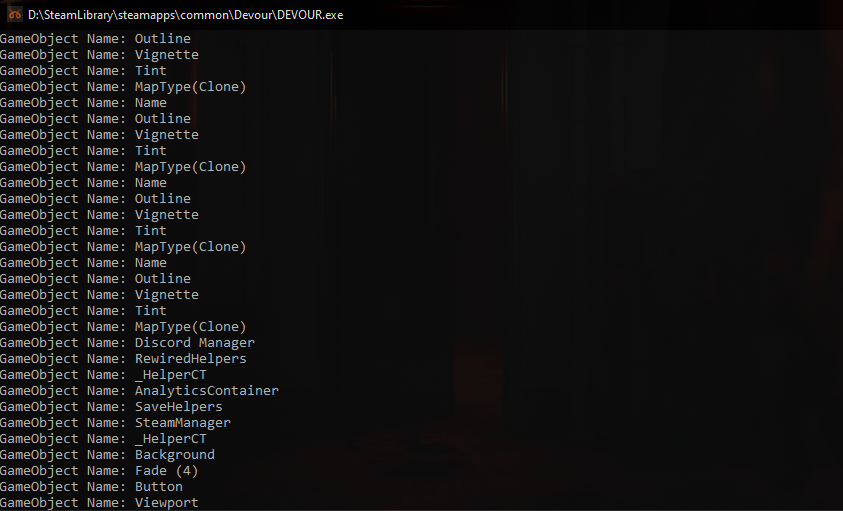
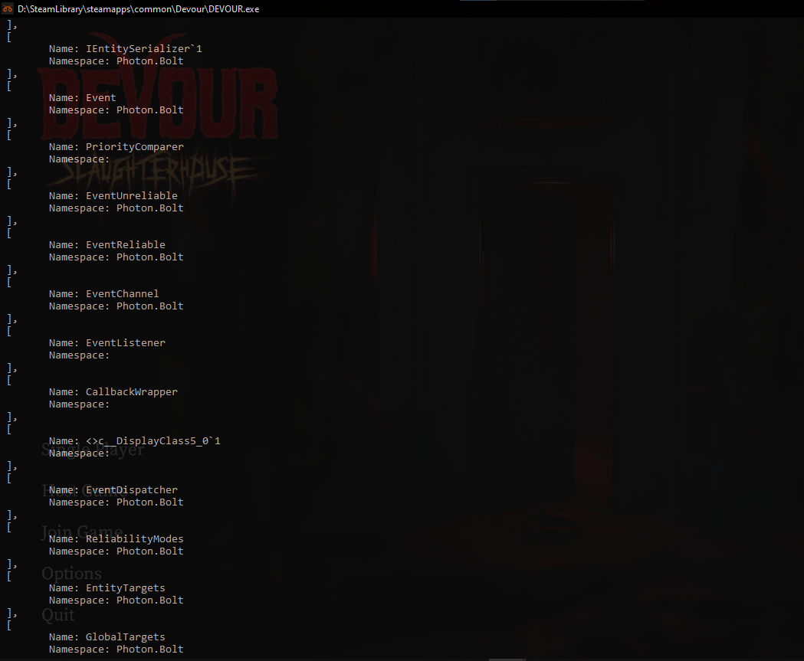
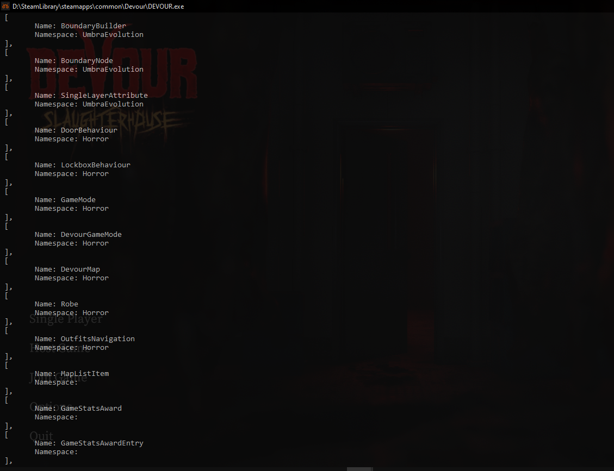
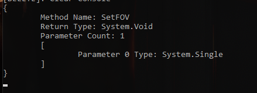
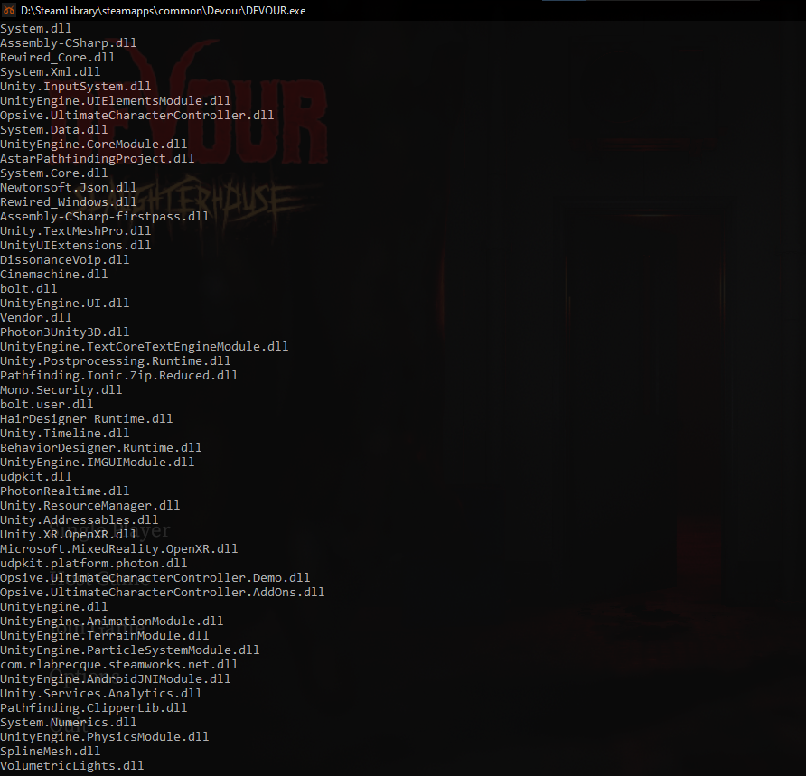
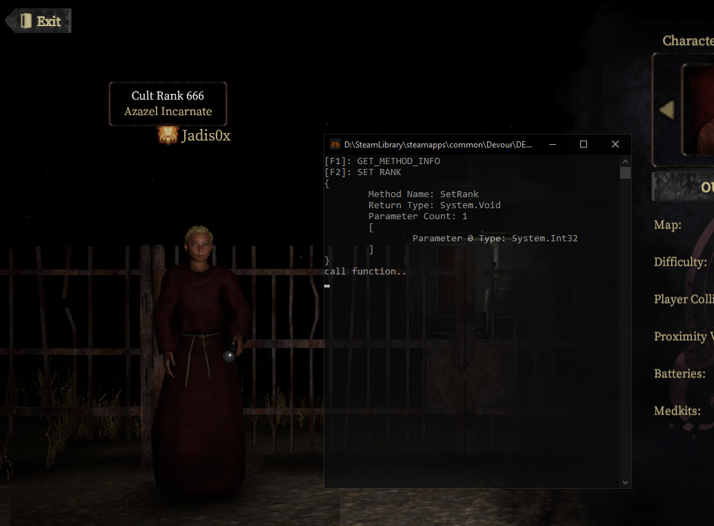
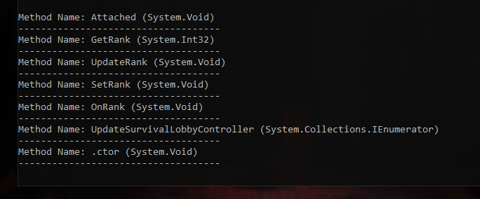
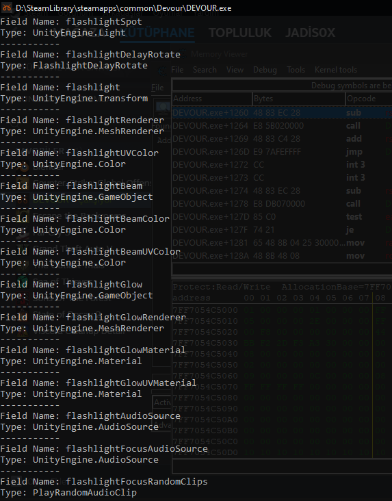

[](https://github.com/jadis0x/il2cpp-reverse-engineering-guide/stargazers)
[](https://github.com/jadis0x/il2cpp-reverse-engineering-guide/graphs/contributors)
[](https://opensource.org/licenses/MIT)

<h3 align="center">Il2cppInspector: C++ Scaffold Guide</h3>

<p>Hello! as I no longer have time for reverse engineering, I have decided to share some useful examples regarding the usage of Il2cppInspector C++ scaffold. In this guide, I will provide examples of how to interact with defined Il2cpp API functions.</p>

IL2CppInspector built with v29 support [DOWNLOAD](https://github.com/ElCapor/Il2CppInspector/releases/tag/2021.2).

> INFO: I have created my own helper class, which you can access from the "lib" folder. I will prepare the examples based on the functions I have created.

## This guide includes examples related to the following questions:

- How to get the type from a class
- How to get class namespaces and names from an image
- How to get the return type and names of any method
- How to invoke functions
- How to fetch fields from a class

## Contact
If you have any questions, feel free to reach out to me. </br>

Discord: Jadis0x </br>
Steam: Jadis0x

## Examples

### Getting the type from a class (Il2CppObject* to Type*)
* To obtain the type information here, we will use the `GetTypeFromClass` function inside my Il2cppHelper class.

```cpp
Il2CppObject* Il2CppHelper::GetTypeFromClass(const Il2CppImage* _image, const char* _namespaze, const char* _name)
{
	Il2CppClass* _targetClass = il2cpp_class_from_name(_image, _namespaze, _name);

	if (_targetClass) {
		const Il2CppType* _targetType = il2cpp_class_get_type(_targetClass);

		if (_targetType) {
			Il2CppObject* targetObject = il2cpp_type_get_object(_targetType);

			if (targetObject) {
				return targetObject;
			}
		}
	}

	return nullptr;
}
```

```cpp
const Il2CppImage* _CoreModule = _Il2CppHelper->GET_IL2CPP_IMAGE("UnityEngine.CoreModule.dll");

if (_CoreModule) {

Il2CppObject* _object = _Il2CppHelper->GetTypeFromClass(_CoreModule, "UnityEngine", "GameObject");

	if (_object) {
		Type* gameobjectType = reinterpret_cast<Type*>(_object);

		if (gameobjectType) {
			Object_1__Array* getAllGameObjects = Object_1_FindObjectsOfType(gameobjectType, nullptr);

			std::cout << "Gameobject count: " << getAllGameObjects->max_length << "\n";
			if (getAllGameObjects) {
				for (int i = 0; i < getAllGameObjects->max_length; i++) {
					Object_1* currentGameObject = getAllGameObjects->vector[i];

					if (GameObject_get_activeInHierarchy(reinterpret_cast<GameObject*>(currentGameObject), nullptr)) {
						std::cout << "GameObject Name: " << il2cppi_to_string(Object_1_GetName(currentGameObject, nullptr)) << "\n";
					}			
				}
			}
		}
	}
}
```

In this example, we are passing the type of the object to be found (GameObject) as a parameter to the "Object_1_FindObjectsOfType" function. This actually allows us to achieve the following:

```cpp
GameObject[] allGameObjects = FindObjectsOfType<GameObject>();
```

> This function is quite slow. Using this function every frame is not recommended.

<p>Output: </p>



### Getting class names and types from a specific assembly

* It prints the list of namespace and class names in the specified image.

```cpp
void Il2CppHelper::GetClassesAndNamesFromAssembly(const Il2CppImage* _image)
{
	if (_image) {
		size_t classCount = il2cpp_image_get_class_count(_image);

		std::cout << "{\n";

		for (size_t i = 0; i < classCount; ++i) {
			const Il2CppClass* _klass = il2cpp_image_get_class(_image, i);

			if (_klass) {
				char* _name = const_cast<char*>(il2cpp_class_get_name(const_cast<Il2CppClass*>(_klass)));
				char* _namespace = const_cast<char*>(il2cpp_class_get_namespace(const_cast<Il2CppClass*>(_klass)));

				std::cout << " [\n";
				std::cout << "\tName: " << _name << "\n";
				std::cout << "\tNamespace: " << _namespace << "\n";

				std::cout << " ],\n";
			}
		}

		std::cout << "\n}\n";
	}
}
```


```cpp
const Il2CppImage* _BoltDll = _Il2CppHelper->GET_IL2CPP_IMAGE("bolt.dll");

if (_BoltDll) {
    _Il2CppHelper->GetClassesAndNamesFromAssembly(_BoltDll);
}
```

or

```cpp
const Il2CppImage* _assemblyCSHARP = _Il2CppHelper->GET_IL2CPP_IMAGE("Assembly-CSharp.dll");

if (_assemblyCSHARP) {
   _Il2CppHelper->GetClassesAndNamesFromAssembly(_assemblyCSHARP);
}
```

<p>Outputs: </p>




### Getting information about any method

* It allows you to print the name, return type, and parameter information of the target method.

```cpp
void Il2CppHelper::GetMethodInfo(const Il2CppImage* _image, const char* _funcName, int argLength, const char* _class_name, const char* _class_namespace)
{
	Il2CppClass* _class = il2cpp_class_from_name(_image, _class_namespace, _class_name);

	if (_class == nullptr) return;

	const MethodInfo* methodInfo = il2cpp_class_get_method_from_name(_class, _funcName, argLength);

	if (methodInfo == nullptr) return;

	Il2CppReflectionMethod* reflectionMethod = il2cpp_method_get_object(methodInfo, _class);

	// Check if the reflectionMethod is not null
	if (reflectionMethod == nullptr) return;

	std::cout << "{\n";

	// Get the method's name from the reflectionMethod object
	const char* methodName = il2cpp_method_get_name(methodInfo);
	std::cout << "\tMethod Name: " << methodName << std::endl;

	const Il2CppType* returnType = il2cpp_method_get_return_type(methodInfo);
	std::cout << "\tReturn Type: " << il2cpp_type_get_name(returnType) << std::endl;

	// Get the parameter count of the method using il2cpp_method_get_param_count
	int parameterCount = il2cpp_method_get_param_count(methodInfo);
	std::cout << "\tParameter Count: " << parameterCount << std::endl;

	std::cout << "\t[\n";
	// Get the parameter types of the method
	for (int i = 0; i < parameterCount; i++) {
		// Get the parameter type at index i using il2cpp_method_get_param
		const Il2CppType* parameterType = il2cpp_method_get_param(methodInfo, i);

		// Get the type name of the parameter type using il2cpp_type_get_name
		const char* parameterTypeName = il2cpp_type_get_name(parameterType);

		// Print the parameter type name to the console
		std::cout << "\t\tParameter " << i << " Type: " << parameterTypeName << std::endl;
	}
	std::cout << "\t]\n";

	std::cout << "}\n";
}
```


```cpp
const Il2CppImage* _AssemblyCSharp = _Il2CppHelper->GET_IL2CPP_IMAGE("Assembly-CSharp.dll");
			
_Il2CppHelper->GetMethodInfo(_AssemblyCSharp, "SetFOV", 1, "NolanBehaviour", "");
```

<p>Output: </p>


### Get the assemblies

* This code retrieves the active domain (Il2CppDomain) and then obtains a list of all assemblies within that domain using the il2cpp_domain_get_assemblies function. It retrieves the assembly name using the il2cpp_image_get_name function and prints the names of these assemblies to the console.

```cpp
// Get the active domain
const Il2CppDomain* domain = il2cpp_domain_get();

// Define variables to hold the assembly list
const Il2CppAssembly** assemblies;
size_t size;

// Use the il2cpp_domain_get_assemblies function to retrieve all assemblies
assemblies = il2cpp_domain_get_assemblies(domain, &size);

for (size_t i = 0; i < size; ++i) {
	const Il2CppAssembly* assembly = assemblies[i];

	if (assembly) {
		// Get the assembly name using il2cpp_image_get_name function
		const char* assemblyName = il2cpp_image_get_name(assembly->image);
		std::cout << assemblyName << "\n";
	}
}
```

<p>Output: </p>


### Calling a function with "il2cpp_runtime_invoke"

```cpp
if (GetAsyncKeyState(VK_F1) & 0x8000) {
	const Il2CppImage* _AssemblyCSharp = _Il2CppHelper->GET_IL2CPP_IMAGE("Assembly-CSharp.dll");
	_Il2CppHelper->GetMethodInfo(_AssemblyCSharp, "SetRank", 1, "NolanRankController", "");
}

if (GetAsyncKeyState(VK_F2) & 0x8000) {
	const Il2CppImage* _csharp = _Il2CppHelper->GET_IL2CPP_IMAGE("Assembly-CSharp.dll");
	if (_csharp == nullptr) return;

	Il2CppObject* nolanObj = _Il2CppHelper->GetTypeFromClass(_csharp, "", "NolanRankController");

	Type* TNolan = reinterpret_cast<Type*>(nolanObj);
	
	auto isTypeValid = Object_1_FindObjectOfType(TNolan, nullptr);

	if(isTypeValid){
	
		NolanBehaviour* _nb_ = reinterpret_cast<NolanBehaviour*>(isTypeValid);

		if (_nb_) {
			Il2CppClass* _nbClass = il2cpp_class_from_name(_csharp, "", "NolanRankController");
			if (_nbClass == nullptr) return;

			const MethodInfo* methodInfo = il2cpp_class_get_method_from_name(_nbClass, "SetRank", 1);

			int newRankvalue = 666;

			void* params[] = { &newRankvalue };

			std::cout << "call function..\n";
			il2cpp_runtime_invoke(methodInfo, _nb_, params, nullptr);
		}
	}
}
```

<p>Output: </p>



### Getting a List of All Functions in the Target Class

* This function, serves the purpose of obtaining and displaying a list of all methods within a given class (specified by the klass parameter). It iterates through each method in the class using a loop, retrieving information such as the method name and its return type. Subsequently, it prints out the method name along with its return type, providing a clear representation of the methods contained within the class

```cpp
void Il2CppHelper::PrintMethods(Il2CppClass* klass) {
	const MethodInfo* methodIter = nullptr;
	void* iter = nullptr;

	// Retrieve all methods of the class
	while ((methodIter = il2cpp_class_get_methods(klass, &iter)) != nullptr) {
		// Get the name of the method
		const char* methodName = il2cpp_method_get_name(methodIter);

		// Get the return type of the method
		const Il2CppType* methodReturnType = il2cpp_method_get_return_type(methodIter);
		char* returnTypeName = il2cpp_type_get_name(methodReturnType);

		// Print the method name and its return type
		std::cout << "Method Name: " << methodName;
		std::cout << " (" << returnTypeName << ")\n------------------------------------\n";

		// Perform necessary memory operations
		il2cpp_free(returnTypeName);
	}
}
```

## Example:

```cpp
const Il2CppImage* _timage = _Il2CppHelper->GET_IL2CPP_IMAGE("Assembly-CSharp.dll");

if (_timage) {
	Il2CppClass* nolanRankControllerClass = il2cpp_class_from_name(_timage, "", "NolanRankController");

	if (nolanRankControllerClass != nullptr) {
		_Il2CppHelper->PrintMethods(nolanRankControllerClass);
	}
}
```

<p>Output: </p>


### Getting Information about Class Fields (FieldInfo)

* It allows us to get information about the fields of a class

```cpp
void Il2CppHelper::GetFieldsInformation(Il2CppClass* klass)
{
	void* iter = nullptr;
	FieldInfo* field = nullptr;

	// Iterate through the fields of the class
	while ((field = il2cpp_class_get_fields(klass, &iter)) != nullptr)
	{
		// Get the name of the field
		const char* fieldName = il2cpp_field_get_name(field);

		// Get the type of the field
		const Il2CppType* fieldType = il2cpp_field_get_type(field);
		char* fieldTypeStr = il2cpp_type_get_name(fieldType);

		// Print the information about the field
		std::cout << "Field Name: " << fieldName << std::endl;
		std::cout << "Type: " << fieldTypeStr << std::endl;
		std::cout << "-----------\n";
	}
}
```


```cpp
const Il2CppImage* _assemblyCSHARP = _Il2CppHelper->GET_IL2CPP_IMAGE("Assembly-CSharp.dll");
			
if (_assemblyCSHARP) {
	Il2CppClass* _nolanBehaviourClass = il2cpp_class_from_name(_assemblyCSHARP, "", "NolanBehaviour");

	_Il2CppHelper->GetFieldsInformation(_nolanBehaviourClass);
}
```

<p>Output: </p>



### Modifiying the Value of a Field

```cpp
if (GetAsyncKeyState(VK_F1) & 0x8000) {
	// Get the Il2CppImage for "Assembly-CSharp.dll"
	const Il2CppImage* _AssemblyCSharp = _Il2CppHelper->GET_IL2CPP_IMAGE("Assembly-CSharp.dll");

	// Get the object for the "Menu" class within the "Horror" namespace
	Il2CppObject* _horrorMenuClassObject = _Il2CppHelper->GetTypeFromClass(_AssemblyCSharp, "Horror", "Menu");

	// Check if the object exists
	if (_horrorMenuClassObject) {

		// Find the object represented by _horrorMenuClassObject in the app
		auto menuType = app::Object_1_FindObjectOfType_1(reinterpret_cast<Type*>(_horrorMenuClassObject), true, nullptr);

		// Check if the object was found
		if (menuType) {

			// Get the Il2CppClass for the "Menu" class
			Il2CppClass* menuClass = il2cpp_class_from_name(_AssemblyCSharp, "Horror", "Menu");
			if (menuClass == nullptr) return;

			// Get the FieldInfo for the "steamName" field
			FieldInfo* steamNameField = il2cpp_class_get_field_from_name(menuClass, "steamName");

			// Check if the field exists
			if (steamNameField) {
				std::cout << "field is exists!!\n";

				// Define a new value for the field
				const char* newSteamNameValue = "il2cpp-field";

				// Create a new Il2CppString from the new value
				Il2CppString* newSteamNameString = il2cpp_string_new(newSteamNameValue);

				// Set the field's value to the new value
				il2cpp_field_set_value(_horrorMenuClassObject, steamNameField, newSteamNameString);
			}
			else {
				std::cout << "field is not exists!\n";
			}
		}
	}
}
```

I will continue to contribute as much as I can. For now, bye!
